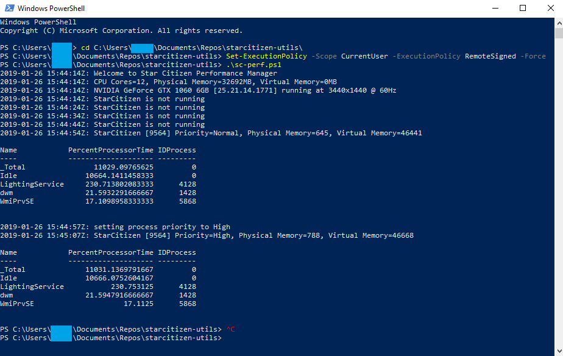

# starcitizen-utils
Star Citizen helper scripts and stuff


## Prerequisites
* A Windows installation with a [StarCitizen](https://robertsspaceindustries.com) installed.
* [Git SCM](https://git-scm.com/download/win) or other git solution for Windows.
* Windows PowerShell(https://docs.microsoft.com/en-us/powershell/scripting/install/installing-windows-powershell)

## Quickstart
1. Clone the repo to the directory of your choosing.
2. Launch Windows PowerShell

3. Update script execution policy to allow unsigned local scripts to be exectuted: 
```
PS >Set-ExecutionPolicy -Scope CurrentUser -ExecutionPolicy RemoteSigned -Force
```
4. Start sc-util.ps1:
```
PS > ./sc-util.ps1
```


